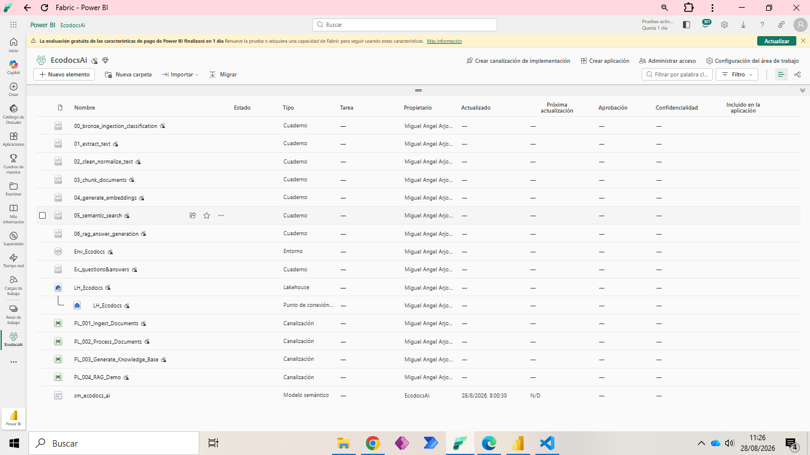
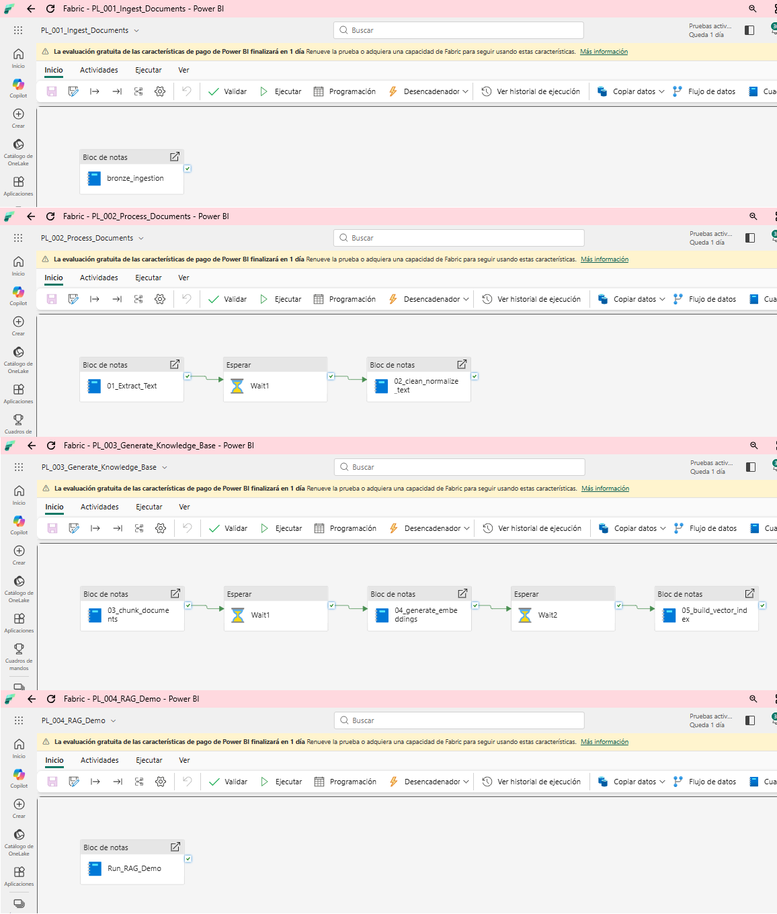
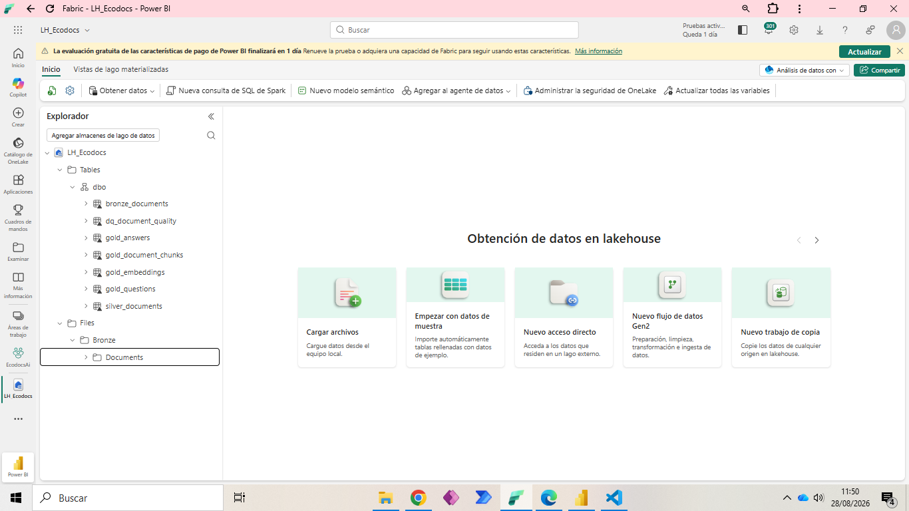
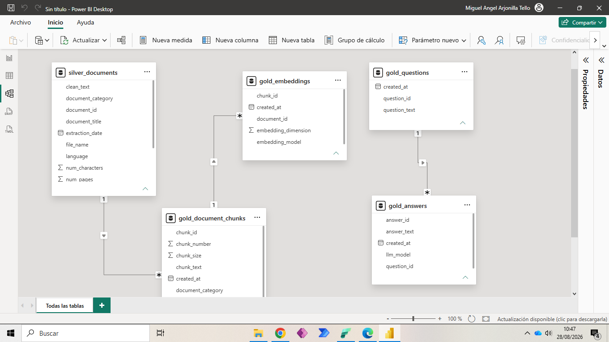

# 🌿 EcoDocs AI: Enterprise RAG Architecture on Microsoft Fabric

Sistema de Recuperación y Generación Aumentada (RAG) End-to-End construido sobre **Microsoft Fabric**, diseñado para la ingesta, evaluación de calidad, fragmentación vectorial y consulta semántica de documentación técnica de energéticas.

---

## 1. Descripción del Problema
Las compañías del sector energético gestionan miles de documentos normativos, manuales de mantenimiento y códigos éticos fragmentados en formatos no estructurados (PDFs, TXTs). Los empleados pierden un tiempo valioso buscando información operativa crítica, lo que provoca retrasos en intervenciones técnicas o incumplimientos de protocolos. Además, las soluciones tradicionales de búsqueda por palabras clave carecen de contexto y no ofrecen respuestas concretas.

## 2. Historia Ficticia del Cliente
**EcoPower Solutions**, empresa líder en generación de energía renovable (eólica y solar), experimentó un crecimiento acelerado que duplicó su volumen documental. El equipo de operaciones en campo y mantenimiento técnico reportó dificultades para acceder rápidamente a la normativa de seguridad laboral y especificaciones de aerogeneradores durante averías críticas. Para solucionar esto, la dirección de IT impulsó la creación de **EcoDocs AI**: un asistente interno capaz de responder preguntas en lenguaje natural garantizando trazabilidad absoluta mediante citas directas a la documentación oficial.

## 3. Arquitectura
El sistema implementa una arquitectura desacoplada en Microsoft Fabric que conecta la ingesta de documentos no estructurados con un motor semántico auditable:

[Fuentes PDF/TXT] ──> [Bronze Lakehouse] ──> [Quality Framework] ──> [Silver Lakehouse]
│
[Power BI Dashboard] <── [Gold Lakehouse] <── [Groq LLM + MiniLM] <──────────┘

## 4. Tecnologías Utilizadas
* **Plataforma Core**: Microsoft Fabric (OneLake, Lakehouse, Notebooks PySpark, Pipelines).
* **Procesamiento de Datos**: Apache Spark (PySpark), Python 3.10, Delta Lake.
* **Vector Embeddings**: `sentence-transformers/paraphrase-multilingual-MiniLM-L12-v2`.
* **LLM (Orquestación RAG)**: Groq API (`llama-3.1-8b-instant`).
* **Visualización & Analítica**: Power BI Desktop (Import Mode / Direct Lake).
* **Control de Versiones**: Git & GitHub.

## 5. Fuentes de Datos
El dataset operativo está compuesto por **20 documentos técnicos**:
* **8 Documentos Reales**: Manuales operativos, código ético y normativas de teletrabajo/desconexión digital.
* **12 Documentos Sintéticos**: Protocolos de mantenimiento de inversores fotovoltaicos, revisiones de subestaciones y medidas de prevención de riesgos laborales (PRL) generados para validación de cobertura.

## 6. Modelo Medallion
* **Bronze (`LH_Ecodocs`)**: Almacenamiento de archivos crudos ingestados en formato binario/texto (`bronze_raw_documents`).
* **Silver (`LH_Ecodocs`)**: Aplicación de limpieza de texto, detección de idioma y un **Data Quality Framework** que asigna puntuaciones de calidad (`quality_score` 0-100) y clasifica documentos en `valid`, `warning` o `invalid` (`silver_documents`).
* **Gold (`LH_Ecodocs`)**: Tablas optimizadas para el motor RAG:
  * `gold_document_chunks`: Fragmentos de texto procesados con solapamiento (*overlap*).
  * `gold_embeddings`: Vectores denso-multilingües derivados.
  * `gold_questions` & `gold_answers`: Registro auditable de consultas e interacciones del LLM.

## 7. Diseño RAG
1. **Indexación**: Lectura de fragmentos en capa Gold y precarga del índice en matriz NumPy normalizada.
2. **Búsqueda Semántica (Retrieval)**: Vectorización de la consulta del usuario y cálculo de similitud coseno ($\text{dot product}$) para recuperar los $k=2$ chunks más relevantes.
3. **Generación Grounded**: Construcción de un *System Prompt* estricto que exige responder **únicamente** con la información proporcionada en el contexto, indicando fuente y página.

## 8. Capturas de Fabric

*Figura 0: Elementos del Workspace EcodocsAi.*

*Figura 1: Data Pipelines (PL_001 a PL_004) orquestando las capas del Lakehouse.*

*Figura 2: Estructura de tablas Delta en el Lakehouse LH_Ecodocs.*

*Figura 3: Configuración del modelo smántico.*

## 9. Capturas de Power BI
*(Agrega las capturas de tus 4 páginas de Power BI)*

*Figura 4: Página 1 - Resumen Ejecutivo.*

*Figura 5: Página 2 - Calidad Documental.*

*Figura 6: Página 3 - Métricas de Uso del Asistente RAG.*

*Figura 7: Página 4 - Monitorización Operativa.*

## 10. Ejemplos de Preguntas y Respuestas

**Pregunta 1**: *¿Cuántos días a la semana se permite teletrabajar en EcoPower?*
> **Respuesta EcoDocs AI**: En EcoPower Solutions se permite el teletrabajo un máximo de 2 días a la semana, previa aprobación del responsable de departamento.
> *Fuente: Política_Teletrabajo_EcoPower.pdf (Pág. 1)*

**Pregunta 2**: *¿A partir de qué velocidad de viento queda prohibido el ascenso a la torre de un aerogenerador?*
> **Respuesta EcoDocs AI**: El ascenso a la torre queda estrictamente prohibido cuando la velocidad sostenida del viento supere los 12 m/s o existan ráfagas superiores a 15 m/s.
> *Fuente: Manual_Operacion_Aerogeneradores.pdf (Pág. 4)*

## 11. Limitaciones
* **Cuota de API REST**: Plan gratuito de Groq sujeto a límites de peticiones por minuto (RPM), mitigado mediante políticas de reintento (*backoff*) y pausas controladas.
* **Búsqueda Vectorial en Memoria**: La búsqueda por similitud coseno actual en NumPy está optimizada para el volumen del proyecto; volúmenes de millones de vectores requerirían integración con un Vector Search engine nativo.

## 12. Próximos Pasos
1. Implementar búsqueda híbrida (Sparse BM25 + Dense Embeddings) para mejorar la precisión en términos de códigos numéricos de piezas.
2. Migrar la persistencia vectorial a una base de datos de vectores dedicada (p. ej., Qdrant o Azure AI Search).
3. Añadir evaluación automatizada de respuestas mediante métricas RAGAS (Faithfulness, Answer Relevance).

## 13. Lecciones Aprendidas
* **Arquitectura de Datos**: El patrón Medallion garantiza que un fallo en la calidad de un documento no contamine el motor RAG.
* **Resiliencia en Pipelines**: El manejo explícito de errores HTTP 429 y estrategias de retry síncronas son indispensables para integrar APIs de LLM externas dentro de entornos Spark/Fabric.
* **Modelo Semántico en Power BI**: Cambiar los modelos de Direct Lake a Importación local permite mantener la continuidad del desarrollo analítico e independizar las métricas frente a caducidades de capacidad en la nube.